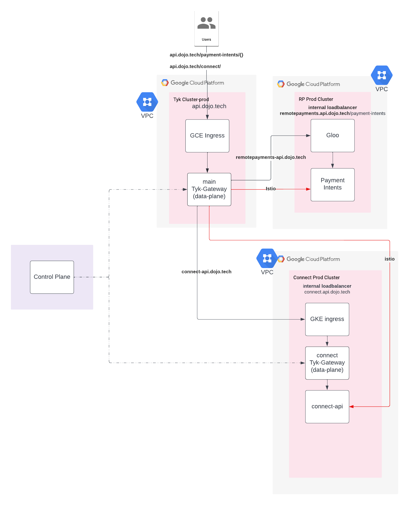

# Onboard to API Gateway
This document will talk  how an application team can get started with central API Gateway provided by Dojo.

There are three first level domain provided by API gateway squad:
1. https://dev-api.dojo.dev/
2. https://staging-api.dojo.dev
3. https://api.dojo.tech

Environment is explicit from domain name.

But on need basis if an application need their own domain i.e. https://identity.dojo.tech, team can always get in touch with [API Gatway Squad](mailto:IDPGateway@dojo.tech?subject=[APIGateway]%20Need%20New%20Domain)

### Current architecture
Diagram explains architecture of one of above setup



We have one central control, One top level data plane for each domain (dev/stg/prod). Top level data plane is connected with corresponding control plane with an external ingress.

Each data plane in application teams cluster will also be connected to same control plane, but access to this data plane is internal to dojo VPC network. 

Tyk top level data plane will route traffic to individual clusters data plane through internal load-balancer.


### Steps for application

Prerequisite :

1. VPC peering between application's cluster network and API gateway cluster network.

2. Enable application team cluster to have internal ingress and load-balancer.
   1. Create Proxy only subnet
   
       ```
       gcloud compute networks subnets create <env>-proxy-only-subnetwork --purpose=REGIONAL_MANAGED_PROXY \
       --role=ACTIVE \
       --region=<region> \
       --network=<cluster network> \
       --range=<subnet within cluster network range> \
       --project <gcp_project_name>
       ```
   2. Reserve internal IP for internal Ingress
   
      ```
      gcloud compute addresses create tyk-ingress-gateway-internal \ 
      --region <region> --subnet <clusters subnet> \
      --project <gcp_project_name> --addresses=<available ip address from clusters subnet range >
      ```
      
   3. Create firewall rule for health check and proxy subnet to communicate
      
      Health Check
   
      ```
      gcloud compute firewall-rules create <env>-fw-allow-health-check \
      --network=development-network \
      --action=allow \
      --direction=ingress \
      --source-ranges=130.211.0.0/22,35.191.0.0/16 \
      --target-tags=development-remotepayments-nat-europe-west2 \
      --rules=tcp \
      --project firefly-dev-2018
      ```
      Proxy only subnet
      ```
      gcloud compute firewall-rules create <env>-fw-allow-proxies \
      --network=development-network \
      --action=allow \
      --direction=ingress \
      --source-ranges=<Proxy only subnet CIDR range> \
      --target-tags=development-remotepayments-nat-europe-west2 \
      --rules=tcp:80,tcp:443,tcp:8080
      ```
      Please make sure to change all parameter values.
   
3. After this API gateway should be able to communicate with application cluster service using internal addresses and applications can create internal load-balancer for tyk data plane

#### Install tyk data plane( Hybrid Gateway ) in cluster

   1. ```git clone https://github.com/dojo-engineering/tyk-helm-chart.git```
   2. ```cd tyk-helm-chart/tyk-hybrid/```
   3. We need to create secret for tyk data plane to communicate with control plane, Get in touch with [API Gateway Squad](mailto:IDPGateway@dojo.tech?subject=[Need]%20Tyk%20Secret%20for%20Environment), to get secret.
      1. ```./installation/install-tykgw.sh``` (internal to API gateway squad)
   4. Create TLS secret for internal ingress based on internal domain application wants to use (*.dojo.dev/ *.dojo.tech/ *.paymentsense.tech)
   5. Update values.yaml changing on internal domain, TLS secret.
   6. ```helm install tyk-hybrid . -f values-platform.yaml --wait ```
   7. Using cloud DNS create subdomain(used in values.yaml) for internal load-balancer reserved in step 2.(ii)
   8. Try https://<internalDomain>/hello to check if cluster tyk data plane is up and running.

#### Install Tyk Operator and CRD
   --To be added---


#### Secret management

Dev Secrets
```
paapi secrets access tyk-auth-dev -a platform -e development
paapi secrets access tyk-org-dev -a platform -e development
paapi secrets access tyk-url-dev -a platform -e development
paapi secrets access tyk-url-mdcb-dev -a platform -e development
paapi secrets access tyk-api-secret-dev -a platform -e development
```

Staging Secrets
```
paapi secrets access tyk-auth-stg -a platform -e staging
paapi secrets access tyk-org-stg -a platform -e staging
paapi secrets access tyk-url-stg -a platform -e staging
paapi secrets access tyk-url-mdcb-stg -a platform -e staging
paapi secrets access tyk-api-secret-stg -a platform -e staging
```

Production Secrets
```
paapi secrets access tyk-auth-prod -a platform -e production
paapi secrets access tyk-org-prod -a platform -e production
paapi secrets access tyk-url-prod -a platform -e production
paapi secrets access tyk-url-mdcb-prod -a platform -e production
paapi secrets access tyk-api-secret-prod -a platform -e production
```

Platform Secrets
```
paapi secrets access tyk-auth-plat -a platforms -e production
paapi secrets access tyk-org-plat -a platforms -e production
paapi secrets access tyk-url-plat -a platforms -e production
paapi secrets access tyk-url-mdcb-plat -a platforms -e production
paapi secrets access tyk-api-secret-plat -a platform -e production
```